# MaxSizeContainer for Godot 3.x
A custom Container node for Godot Egine 3.x, to limit the size of children nodes.  
All Control nodes have a `rect_min_size` property, but they lack the `rect_max_size`. The **MaxSizeContainer** aims at solving this issue.

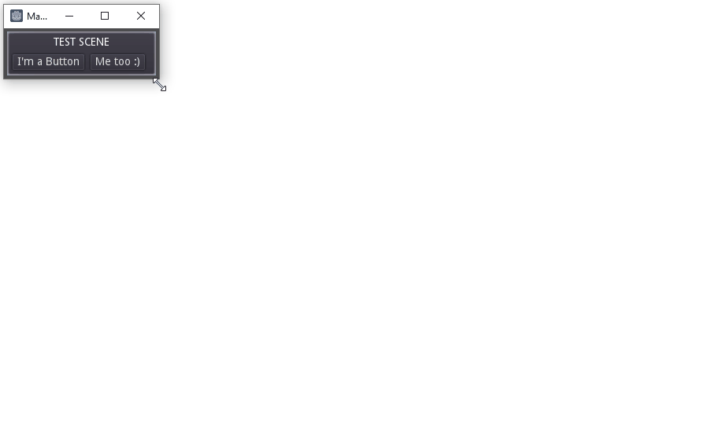

# Installation
- Copy `addons/MaxSizeContainer` into your project (final path should be `res://addons/MaxSizeContainer`).

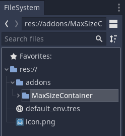

- In the Godot Editor, go to **Project Settings > Plugins** and enable the **MaxSizeContainer** plugin.

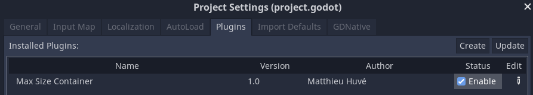


# Usage
To be limited in size, a Control node must be child of a **MaxSizeContainer**.  

 - From the editor, press **Add a new node**, and select **MaxSizeContainer**

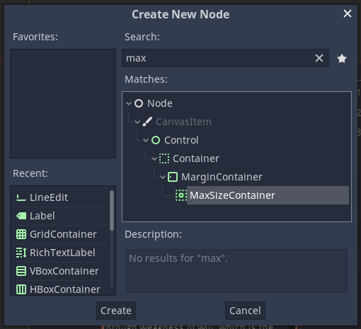  
*Note: to add the Container from script, you must use this code:*
```gdscript
var MaxSizeContainer = preload("res://addons/MaxSizeContainer/max_size_container.gd")

add_child(MaxSizeContainer.new())
```

 - Add any Control node as a child of MaxSizeContainer.  
 *Note: only one (1) child is supported*

 - Select the maximum size, and how you want the child node aligned when it reaches the maximum size.  
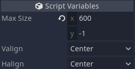  
*(-1 means no limit)*

# Examples
- Let's start from this scene.  

| 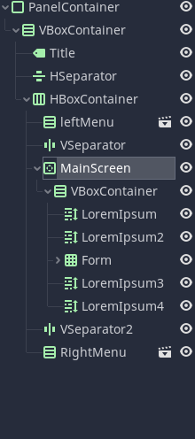 | 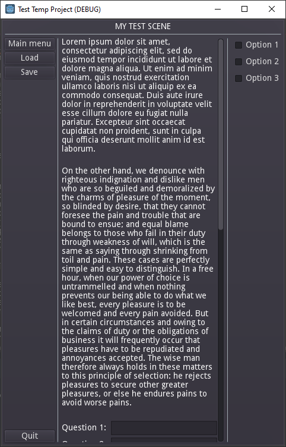  | 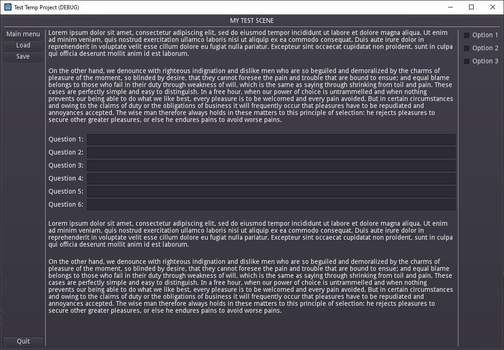 |
|:---:|:---:|:---:|
| Scene tree | Small window | Large window |  

When the window is enlarged, the main scene takes all the available space, as it is set as Expand.

 - To prevent that and make the text more readable, let's add a **MaxSizeContainer**, child of `MainScreen (ScrollContainer)` and parent of `VBoxContainer`:  

| 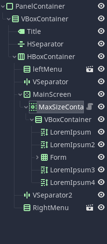 |   | 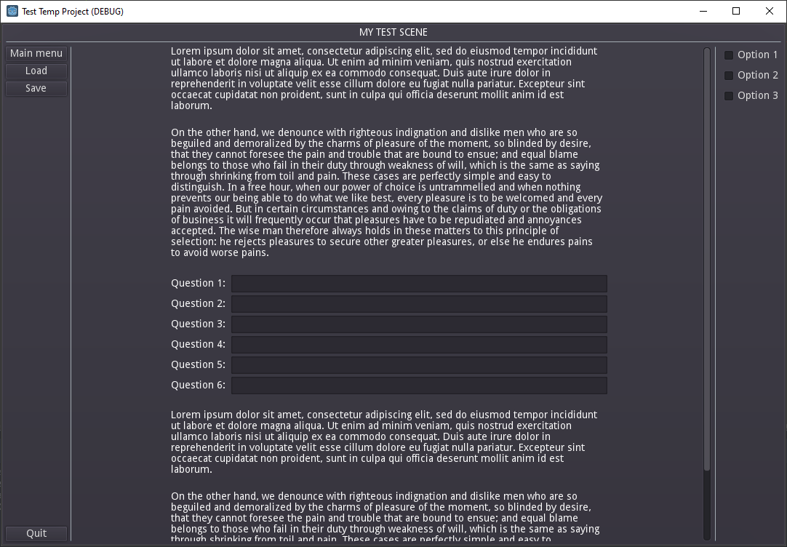 |
|:---:|:---:|:---:|
| Scene tree | Parameters | Large window | 

- You can also nest different **MaxSizeContainers** together, and have fun:  

| 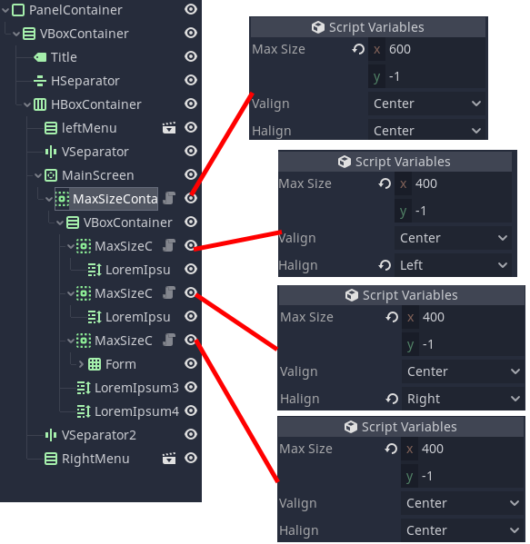 | 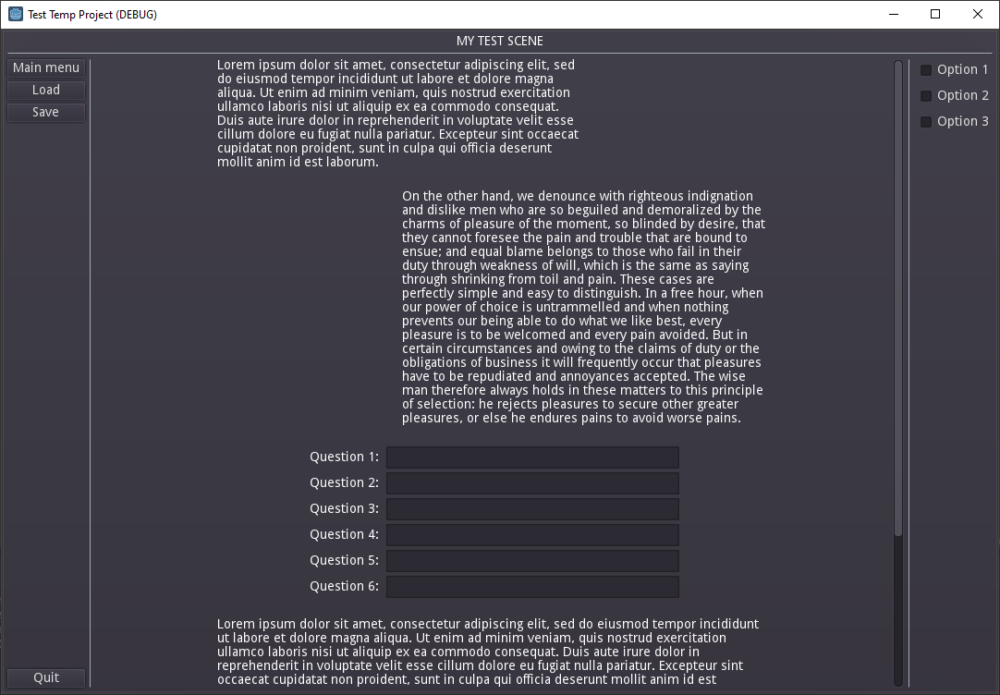 |
|:---:|:---:|
| Scene tree and parameters | Large window | 

# Troubleshooting  

If the container doesn't work, try these solutions:
 - Make sure there is only one child node, and it inherits from **Control**
 - Make sure the child node's size flag are set to **Fill** vertically and horizontally.
 - Make sure `max_size` is bigger than the minimum possible size of the child.

# License

See [License file](https://github.com/MattUV/godot-MaxSizeContainer/blob/master/LICENSE.md)  
This README page was greatly inspired by [jmb462](https://github.com/jmb462/GodotQuickSettings/blob/main/README.md).
